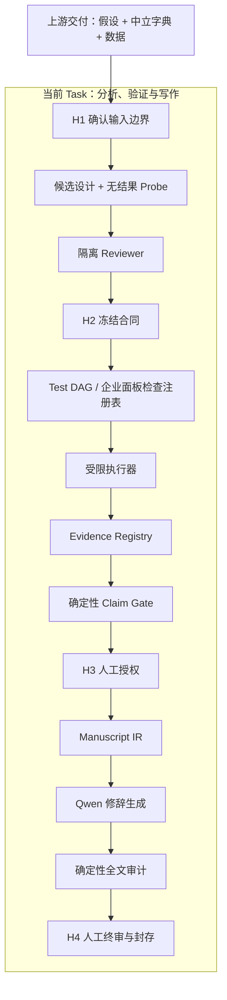

# HypoWeaver-Qwen 下一步接手与优化路线

> 文档状态：2026-07-16 交接基线
> 适用范围：Group 2 Task 3——从“研究假设 + 中立数据说明 + 数据资产”到真实验证、审计和论文初稿
> 当前目标：把现有工作流进一步收敛成“反证优先的证据—主张编译器”，而不是继续增加会写意见的 Agent

### 本文只覆盖当前 Task

本文默认上游已经交付：

- 明确的研究问题与待验证假设；
- 不含论文结果的中立变量字典；
- 可执行的数据资产及哈希；
- 必要的样本、变量来源和研究边界说明。

本文只讨论下面这段工作：

```text
给定假设与数据
→ 设计并冻结分析方案
→ 真实执行与反证
→ 审计证据并约束结论
→ 生成可追溯论文初稿
```

数据中心、政策/论文采集、知识图谱、Text-RAG / Graph-RAG、研究空白发现、自动提出新假设和科研绘图均不在本文范围内。上游暂时只通过结构化输入对象与本 Task 对接，不在本仓库内重建。

## 1. 接手者先看这里

如果是第一次接手，请按下面的顺序操作。

### 1.1 先理解四条不可破坏的边界

1. `backend/src/hypoweaver/definition.py` 和 Pydantic Schema 是运行时事实源；`public/workflows/*.yml` 只是历史参考。
2. App A 不得读取原论文、作者代码、原始回归表或 `02_hidden_reference`；这些材料只能在主流程封存后由 App B 评测。
3. `execution_status=success` 只表示代码运行成功，不代表 `scientific_status=valid`。
4. 同级 Agent Laboratory 是外部基线。不要把 HypoWeaver 的 Reviewer、H2 冻结或 ClaimLedger 加进基线。

### 1.2 本地启动与基础验证

```bash
cd hypoweaver-workflow
npm install
PYTHONPATH=backend/src python3.11 -m unittest discover -s backend/tests -v
npm test
npm run build
```

启动三个本地服务：

```bash
PYTHONPATH=backend/src python3.11 -m uvicorn hypoweaver.api:app --port 8000
PYTHONPATH=backend/src python3.11 -m uvicorn hypoweaver.research_api:app --port 9000
npm run dev -- --port 5174
```

前端地址为 `http://127.0.0.1:5174`。真实案例、API Key、运行数据库和上传文件不在 Git 仓库中；需要在本机单独配置和导入。

### 1.3 建议先读的代码

| 目的 | 文件 |
|---|---|
| 查看正式工作流节点和阶段 | `backend/src/hypoweaver/definition.py` |
| 查看研究对象、合同、Run、Claim 和稿件 Schema | `backend/src/hypoweaver/models.py` |
| 查看状态转移、H1—H4、Reviewer 和写作审计 | `backend/src/hypoweaver/engine.py` |
| 查看当前重点的企业面板执行 | `backend/src/hypoweaver/research_engine.py` |
| 查看 Qwen 调用与模型配置 | `backend/src/hypoweaver/adapters.py`、`runtime_config.py` |
| 查看前端运行控制台 | `src/components/ExecutionWorkspace.tsx` |
| 查看本轮真实案例证据 | `docs/cases/case_001_esg_sdla/FINAL_EXECUTION_REPORT.md` |
| 查看 Group 2 边界与 Benchmark 设计 | `docs/GROUP2_WORKFLOW_ARCHITECTURE.md` |

## 2. 对“AI Scientist 工作流优化”讨论的判断

参考讨论最有价值的启发不是某一个新 Agent 名称，而是下面这个判断：

> 并行生成更多分析和章节只提高吞吐量；真正提高科研可信度的，是让每个测试、证据、主张和论文句子之间形成不可绕过的机器约束。

因此，本项目下一步建议采用“反证优先的证据—主张编译器”作为产品和技术主线：

```text
上游已交付的假设、变量字典与数据
→ 冻结研究合同
→ 为科学威胁生成可执行测试
→ 真实执行并保存正反证据
→ 代码判定 Claim 最大允许强度
→ 从获准 Claim、真实数字和引用证据编译论文
```

参考讨论中提到的论文、系统名称和效果数字，本轮没有逐项做来源核验，因此不把它们当作项目事实或性能承诺。下面的改造建议来自当前源码、实际 Run 和 Case 001 暴露的问题。

## 3. 当前系统已经不是普通“多 Agent 并行写作”

当前版本已经具备以下运行时约束：

| 能力 | 当前实现 | 结论 |
|---|---|---|
| 研究边界 | H1 服务端暂停、修订、拒绝 | 已落地 |
| 多方案竞争 | 三种不同目标的候选设计 | 已落地 |
| 低成本预检 | 每个候选执行无结果 Probe | 已落地 |
| 隔离审查 | 测量、因果、统计、复现四类 Reviewer | 已落地 |
| 方案冻结 | H2 选择候选并冻结 `FormalResearchContract` 哈希 | 已落地 |
| 真实执行 | 受限 Python 执行器按冻结步骤运行 | 已落地，方法覆盖仍有限 |
| 复算审计 | 同一冻结合同再次执行并做数值容差比较 | 已落地，但不是独立实现 |
| 双状态 | 分开保存执行状态与科学状态 | 已落地 |
| 结论约束 | ClaimLedger + H3 逐条授权 | 已落地，但准入仍部分依赖 LLM/人工 |
| 论文约束 | 八节写作、Claim/Run 绑定、内容审计、H4 | 已落地，但还不是句子级编译 |
| 盲测隔离 | App A 与隐藏参考物理分离，App B 终态后评分 | 已落地 |

所以，不需要推翻当前架构，也不应再把 19 个角色逐一实现成长驻 Agent。下一步应复用现有对象，把“审查意见”进一步编译成“必须执行的检查”，把“Claim 表格”进一步编译成“代码可判定的准入状态”。

## 4. 本轮真实案例暴露出的关键不足

Case 001 已经真实执行基准、诊断、两种替代结果、前导项证伪和两个交互边界。它证明现有流程能够跑通，也暴露了五个结构性缺口。

### 4.1 Claim 最大强度还没有完全由代码决定

当前 `EvidenceAssessment`、`ScientificAudit` 和 `ClaimLedger` 主要由模型生成，H3 再由人类批准或降级。代码能阻止 Fixture 产生统计结论、阻止被禁止的 Claim 获批，也会审计 Claim/Run 引用，但还没有统一的确定性规则回答：

- 前导项证伪失败后，主 Claim 是否必须降级；
- 只运行基准模型时，最多允许“初步关联”还是“关联”；
- 因果 Claim 缺少必要诊断时，能否进入正文；
- 复算一致但识别无效时，为什么仍不能使用因果措辞。

这应成为第一优先级，因为它直接决定系统是否只是“让另一个 LLM 审核 LLM”。

### 4.2 当前计划是冻结清单，还不是决策相关的 Test DAG

`AnalysisPlan` 已有诊断、稳健性、证伪、机制和异质性步骤，但每个 `PlannedStep` 目前主要记录名称、理由、字段和参数。它还没有明确记录：

- 该测试针对哪个科学威胁；
- 它会改变哪条 Claim；
- 通过和失败分别触发什么状态变化；
- 它是探索性还是验证性；
- 它是否是 Claim 准入的必做检查。

因此执行器现在是在“运行冻结列表”，而不是“运行最能改变科学判断的下一项测试”。

### 4.3 Falsification 还没有形成方法级强制检查包

Case 001 的未来一期 ESG 前导项显著，成功暴露了前瞻性或反向因果风险；这是本轮最有科研价值的结果之一。但该测试来自本次计划，不是面板研究方法注册表自动要求的检查。

下一步需要先让企业面板方法自动带出强制检查包，至少覆盖主键、单例、组内变异、缺失、聚类层级、替代测量、前导/安慰剂和样本敏感性。DID、IV、事件研究和空间模型的检查包先记为后续扩展，不作为本轮交接任务。

### 4.4 “独立复现”目前是同一实现的再次运行

当前复算可以发现随机性、数据漂移和结果不稳定，但主运行与复算仍调用同一个执行器实现。这是确定性重跑，不等于实现独立性。

企业固定效应基准可以增加第二条实现路径，例如用显式组内变换或另一统计包复算核心系数、标准误和样本流。两条路径不共享中间结果，只共享冻结合同和数据哈希。

### 4.5 论文仍是“受约束生成”，还不是严格的论文编译

当前稿件在章节级绑定 `claim_ids` 和 `run_ids`，并由代码审计未授权 Claim、虚构结果、因果越界和常见方法误写。这已经比自由写作可靠，但模型仍会直接组织数字和实证句子。

目标态应把数字、样本范围、Claim 强度和必要限制做成受保护字段，由代码注入；模型只润色非保护文本。正式文献引用也必须绑定检索到的原文段落，在上游 RAG 未提供证据前继续禁止模型凭记忆生成引用。

## 5. 建议的最小目标架构



这张图只新增三个运行时能力，不新增常驻 Agent：

1. `Test DAG / 方法检查注册表`：把 Reviewer 问题转成可执行任务；
2. `Evidence Registry + Claim Gate`：用代码判定主张准入和最大措辞；
3. `Manuscript IR`：让论文中的实证句子绑定 Claim、Run、数字和引用证据。

## 6. 实施顺序与验收标准

### 里程碑 1：Executable Evidence Contract 与确定性 Claim Gate

目标：任何 Claim 的准入状态和最大措辞都有代码依据，模型不能自行升级。

建议修改：

- `models.py`
  - 为 `ClaimRecord` 增加 `claim_type`、`required_check_ids`、`admission_status` 和 `max_allowed_wording`；
  - 为 `ExecutionRecord` 增加稳定的检查 ID、实现 ID、数据/代码/环境哈希；
  - 增加最小 `EvidenceObject`，把一次执行映射为支持、反对、未完成或无效证据。
- 新增 `claim_gate.py`
  - 只做确定性规则，不调用 LLM；
  - 输入为冻结合同、执行记录、复算审计和 ScientificAudit；
  - 输出为 Claim 的可允许状态与措辞上限。
- `engine.py`
  - 在模型生成候选 Claim 后、进入 H3 前执行 Claim Gate；
  - 模型给出的强度高于代码上限时自动降级或阻塞。

最小规则示例：

```text
普通面板回归 + 所有必做检查完成 + 无致命问题
  → 最多 associational

证伪失败 / 关键稳健性结果冲突
  → mixed 或 preliminary

因果 Claim + 必做识别诊断未完成
  → prohibited

复算失败 / 数据哈希不一致 / 合同偏离
  → rejected
```

验收测试：

- 修改 LLM 输出，让它把关联写成因果，代码必须拒绝；
- 构造前导项证伪失败，主 Claim 必须自动降级；
- 构造基准显著但复算不一致，Claim 不得进入 H3 可批准列表；
- Fixture 和未执行任务仍不得产生任何可准入实证 Claim。

### 里程碑 2：从冻结列表升级为 Test DAG

目标：每个测试都必须说明它解决什么威胁、影响什么 Claim；没有决策价值的步骤不运行。

先对现有 `PlannedStep` 做最小扩展，不另建复杂编排服务：

```text
threat_id
target_claim_ids
test_role = diagnostic | robustness | falsification | replication | exploratory
required_for_admission
```

第一版仍可按确定性优先级顺序执行，不急着实现概率模型或贝叶斯调度。先保证：

- Reviewer 的 `required_fix` 能落到一个具体 `PlannedStep`；
- 每个执行记录能回写对应威胁和 Claim；
- 测试失败会改变 Claim 状态，而不是只在日志里留一句警告；
- H2 之后不得按显著性临时增加分支。

企业面板第一版方法检查包：

1. 主键唯一性、重复观测与单例样本流；
2. 核心字段缺失率和组内变异；
3. 固定效应与聚类层级可执行性；
4. 主结果替代测量；
5. 前导项或适用的安慰剂证伪；
6. 样本窗口或异常值口径敏感性；
7. 冻结的机制/交互边界；
8. 独立复算。

验收测试：

- 每个 required Reviewer 问题都有执行步骤或明确 `not_executable` 原因；
- 每个 required 步骤都有终态，不能静默消失；
- 预算耗尽时明确标记未执行，并自动限制 Claim 强度；
- 结果不显著、反向或失败时仍完整保留运行记录。

### 里程碑 3：Manuscript IR 与受保护数字

目标：论文不再由模型手抄统计结果，而从获准证据编译。

建议在当前 `ManuscriptSection` 下增加句子级绑定对象：

```text
statement_id
claim_id
execution_ids
text_template
protected_values
citation_passage_ids
```

推荐两步生成：

1. 代码生成事实句和占位符，例如系数、标准误、p 值、样本量、适用范围和最大允许措辞；
2. Qwen 只改写非保护文本，随后代码再次核对所有保护值和 Claim 强度。

验收测试：

- 模型把 `-0.1512` 改成其他数字，全文审计必须失败；
- 摘要、结果、讨论和结论中的同一数字必须来自同一 Execution ID；
- 没有获准 Claim 的实证句不能进入稿件；
- 没有 passage 绑定时不能生成正式文献引用；
- 未执行的稳健性、机制或异质性不能写成已完成结果。

### 里程碑 4：实现独立复现与故障注入

目标：把“同一代码重跑”升级为“不同实现交叉复核”，并证明系统能发现科研故障。

企业固定效应案例先实现第二条最小路径：

- 主路径：当前 `linearmodels.PanelOLS`；
- 复核路径：显式组内变换或另一统计实现；
- 比较样本流、系数、标准误和关键诊断；
- 两条路径只共享数据哈希与冻结合同，不共享主运行输出。

随后建立故障注入测试：

- 重复合并导致样本膨胀；
- 时间泄漏或前导变量误用；
- 单位放大；
- 处理组或政策时间偏移；
- 错误聚类层级；
- 只保留显著分组；
- 表格与正文数字不一致；
- 关联结果被写成因果；
- 删除空结果或失败分支。

验收指标不只看“稿件好不好”，至少记录致命问题召回率、误报率、合同到执行忠实度、数字一致率、独立复现率和因果措辞越界率。

### 里程碑 5：当前 Task 的 Benchmark 与消融

先固定已经跑通的企业面板案例，不在这一里程碑扩展数据采集、假设生成或新的方法家族。对照组保持相同模型家族和尽量接近的调用预算：

- Qwen 单次端到端；
- Agent Laboratory 原始基线；
- 完整 HypoWeaver；
- 去掉 Reviewer、Probe、H2、独立复现、Claim Gate 或 Manuscript IR 的消融版本。

统一比较方法设计忠实度、冻结步骤完成率、致命问题发现率、数字一致率、Claim 越界率、初稿证据可追溯率和人工修订成本。只有当前企业面板案例稳定后，再由模型库建设任务决定是否增加 DID 或空间方法检查包。

## 7. Qwen3.7 Plus 与 Max 的使用原则

当前代码已经将常规生成与高风险审核分层：默认配置模型处理一般任务，四类 Reviewer 使用 `qwen3.7-max`，写作只有在通用质量审计失败后才升级到 Max。建议继续沿用动态升级，而不是让 Max 固定扮演一个常驻 Agent。

建议的 Max 触发条件：

- 候选设计包含因果主张；
- Reviewer 之间存在关键冲突；
- 独立复现失败；
- 某个分支会改变主结论；
- Writer 请求比 Claim Gate 更强的措辞；
- 通用质量审计连续失败。

注意：Plus 生成、Max 审核不等于独立验证。独立性来自信息隔离、不同目标、不同统计实现和确定性规则。

## 8. 不建议现在做的事情

- 不把 19 个角色全部实现成长驻 Agent；
- 不增加没有明确状态输入输出的开放式辩论；
- 不用 Elo、总分或多数投票决定科学真值；
- 不先建一个庞大的 World Model 或跨项目记忆平台；
- 不为了贴近原论文结果而在 H2 后更换样本、变量或模型；
- 不把 Agent Laboratory 改造成 HypoWeaver 的另一份实现；
- 不在没有文献 passage 的情况下让 Writer 自动补引用。

这些内容有些以后可能有价值，但当前最重要的是把已有合同、执行、Claim 和写作链路变成更强的可执行约束。

## 9. 建议的任务拆分

| 任务 | 主要产物 | 前置依赖 | 完成标志 |
|---|---|---|---|
| T1 Claim Gate | `claim_gate.py`、Schema 和规则测试 | 无 | 强度越界被代码阻止 |
| T2 Test DAG | `PlannedStep` 扩展、方法检查注册表 | T1 的 required check 定义 | 每个 required test 都影响 Claim 状态 |
| T3 Panel 独立复现 | 第二统计实现、对比器 | T2 | 两条实现结果在容差内一致或明确阻塞 |
| T4 Manuscript IR | 句子级绑定与数字注入 | T1 | 数字与措辞不能被模型篡改 |
| T5 模块 Benchmark | 当前企业面板案例、故障注入、消融报告 | T1—T4 | 可复现实验表和失败案例齐全 |

建议先由一名同学完成 T1，一名同学完成 T2 的 Schema/企业面板检查注册表，一名同学整理当前 Case 001 的故障注入与对照脚本。T3 和 T4 在 T1 接口稳定后并行推进。

## 10. 提交规范与公开仓库安全

任何提交都必须先运行：

```bash
PYTHONPATH=backend/src python3.11 -m unittest discover -s backend/tests -v
npm test
npm run build
git diff --check
```

公开仓库禁止提交：

- `backend/var/` 下的 API 配置、Token、SQLite、封存密钥、上传数据和运行产物；
- 原始 CSV、DTA、论文 PDF、作者代码、回归表和隐藏参考；
- `node_modules/`、`dist/`、`tmp/`、缓存和测试截图；
- 本机用户名、绝对路径和真实凭据。

`.gitignore` 已覆盖主要运行目录，但提交前仍需人工查看 `git status --short` 和暂存区文件列表。文档中允许出现环境变量名称和省略号示例，不允许出现真实值。

## 11. 一句话交接

当前系统已经完成“安全输入 → 多方案设计 → 冻结合同 → 真实执行 → 证据审计 → Claim 授权 → 完整论文”的可运行闭环。下一步不要重写工作流，也不要继续堆 Agent；应把 Reviewer 意见变成可执行 Test DAG，把 Claim 准入变成确定性规则，把论文变成由获准证据编译出的可追溯产物。
