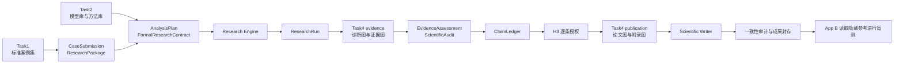

# HypoWeaver 总体架构与 Task4 科研绘图接入规范

> 文档状态：HypoWeaver 科研绘图实现规范；2026-07-22 已按同仓、进程内模块完成接入并转由主仓维护
>
> 适用范围：Task1 论文案例集、Task2 模型/方法库、Task3 假设验证与复现工作流、Task4 自动化科研绘图
>
> 当前事实源：`backend/src/hypoweaver/definition.py` 与 `backend/src/hypoweaver/models.py`

> 实现更新：原文中的“独立仓库 / 独立 HTTP 服务”是已废止的早期交接方案。`carolzhu-jr/GreenFinance_Plot_Agent` 的渲染能力已按基线提交合入 `backend/src/hypoweaver/plot_agent/`，保留来源署名；从现在起由 HypoWeaver 主仓维护，并由 `visualization.py` 在同一工作流进程内调用，不需要额外端口或同学继续交付。保留严格 Figure 契约，是为了隔离“绘图”和“写作”，不是为了分仓。

## 1. 文档目的

这份文档用于统一四项任务之间的架构和数据边界，并作为 HypoWeaver 主仓科研绘图模块的实现与验收规范。

科研绘图不是一个只在论文完成后“美化图片”的前端组件。它是主工作流内的确定性模块，承担两类工作：

1. 在模型执行后生成诊断图和证据图，供 Evidence Assessment、Scientific Audit 和 H3 人工审核使用；
2. 在 H3 授权结论后生成论文主图和附录图，供 Scientific Writer 引用并随成果包封存。

Task4 不负责提出研究假设、选择计量方法、重新估计模型或判断科学结论。

## 2. 四项任务的职责

### 2.1 Task1：标准论文案例集

Task1 从高质量论文中提取结构化研究案例，至少包括：

- 研究问题与理论背景；
- 原论文提出的假设；
- 分析单位、样本范围和时间范围；
- 变量定义、变量角色和数据字典；
- 原论文采用的数据及可复现的数据文件；
- 原论文采用的方法、模型、稳健性检验和识别策略；
- 原论文最终结果、表格、图形和代码。

这里更准确的称呼是“标准案例集”或“Benchmark 数据集”。只有在明确进行模型微调时，才称为训练集。

每个案例必须分为可见输入和隐藏参考：

```text
case_xxx/
  01_model_input/
    case_profile.json
    hypotheses.json
    data_dictionary.csv
    main_data.csv

  02_hidden_reference/
    published_results.json
    original_tables/
    original_figures/
    original_code/
    evaluation_rubric.json
```

运行 Task3、Task4 和外部基线时，只允许访问 `01_model_input`。`02_hidden_reference` 只允许独立的 App B 盲测服务在主流程封存后读取。

### 2.2 Task2：模型库和方法库

Task2 提供可被 Task3 路由和执行的研究方法能力，包括：

- 方法家族及适用条件；
- 估计器实现；
- 必需字段和数据结构约束；
- 诊断、稳健性、证伪、机制和异质性检验；
- 每种方法的标准输出 Schema；
- 每种方法对应的推荐图形配方。

Task2 负责“怎样估计”，Task4 负责“怎样把已经产生的结果可追溯地画出来”。Task4 不得复制或重新实现 Task2 的统计估计逻辑。

### 2.3 Task3：假设验证与复现工作流

Task3 是总调度器，当前正式链路为：

```text
标准案例包
→ 规范化与确定性校验
→ H1 研究边界确认
→ 假设拆解 + 数据画像
→ 方法路由
→ 方法设计
→ 四类 Critic 与有限修复
→ H2 冻结 FormalResearchContract
→ Fixture / Python Research Engine
→ ResearchRun
→ H3 前证据图
→ EvidenceAssessment + ScientificAudit
→ ClaimLedger
→ H3 逐条结论授权
→ H3 后论文图
→ 受约束写作与一致性审计
→ 封存成果包
```

Task3 保证：

- H1/H2/H3 是真正会暂停、退回和等待的服务端状态机；
- H2 后的执行必须绑定冻结合同和数据哈希；
- `execution_status=succeeded` 不等于 `scientific_status=valid`；
- Fixture 不得产生系数、p 值、显著性或诊断结果；
- Writer 只能使用 H3 已授权的 Claim；
- 主流程在封存前不得读取隐藏参考结果。

### 2.4 Task4：自动化科研绘图模块

Task4 接收结构化研究结果和授权信息，返回可审计、可复现的图形成果包。

它必须同时满足：

- 论文级视觉质量；
- 确定性和可复现性；
- 与 Execution、Claim 的双向追溯；
- 不补造缺失统计量；
- 不访问隐藏参考；
- 通过 HypoWeaver 的严格 Figure 契约供主工作流调用。

## 3. 当前架构与 Task4 的目标位置



科研绘图使用同一个进程内模块完成两次调用，但两次调用的权限和输入不同。

### 3.1 Evidence 阶段调用

位置：`ResearchRun` 生成后，`EvidenceAssessment` 之前。

允许输入：

- `FormalResearchContract` 的标识、哈希及绘图所需设计字段；
- `ResearchRun`；
- `ExecutionRecord`；
- 经登记的数据或结果 Artifact 引用；
- 未经 H3 授权的结果只能用于审计，不得被描述成最终结论。

主要输出：

- 系数与置信区间图；
- 样本筛选流程图；
- 分组趋势、变量分布、相关性和描述统计图；
- 平行趋势与事件研究图；
- 规格、机制假设关系、异质性和空间结果图。

输出 Artifact：`evidence_figure_bundle`。

### 3.2 Publication 阶段调用

位置：H3 授权后，`Scientific Writer` 之前。

允许输入：

- `evidence_figure_bundle`；
- H3 已批准或降级的 `approved_claim_ledger`；
- 获批 Claim 引用的 Execution；
- 期刊样式和语言要求。

主要输出：

- 论文主图；
- 附录图；
- 中性标题和图注；
- 无障碍描述；
- Figure、Claim、Execution 的追溯信息。

输出 Artifact：`publication_figure_bundle`。

Publication 阶段不得展示被 H3 拒绝、暂缓或未处理的 Claim，也不得通过标题、图注或视觉强调提高 Claim 的授权强度。

## 4. Task4 的系统边界

### 4.1 科研绘图模块负责

- 管理版本化图形配方；
- 根据结构化上下文选择合适配方；
- 验证字段绑定；
- 从已登记 Artifact 读取绘图数据；
- 确定性渲染 SVG、PNG 和 PDF；
- 导出每张图对应的源数据 CSV；
- 生成标题、图注和 alt text；
- 记录输入、配方、软件和输出哈希；
- 返回结构化 `FigureBundle`。

### 4.2 科研绘图模块不负责

- 提出或修改研究假设；
- 决定应该采用哪一种计量方法；
- 重新运行回归或计算新的科学结果；
- 访问原论文、原论文结果或 `02_hidden_reference`；
- 把 p 值或显著性自动解释为因果关系；
- 绕过 H1/H2/H3；
- 在 Task3 Web 进程内执行大模型生成的任意代码；
- 自行决定 Claim 是否成立。

## 5. 推荐内部设计

Task4 建议由四层组成。

### 5.1 Recipe Registry

每个图形配方必须有稳定 ID 和版本，例如：

```text
coefficient_forest@1.0
sample_flow@1.0
event_study@1.0
heterogeneity_forest@1.0
specification_curve@1.0
```

配方声明：

- 适用的研究方法和执行类型；
- 必需字段；
- 可选字段；
- 字段类型和单位；
- 允许的视觉编码；
- 默认排序和坐标轴规则；
- 允许的输出格式；
- 图形质量和审计规则。

### 5.2 Deterministic Figure Selector

当前实现不使用生图模型，也不让大模型生成或执行 SVG、Python、R 或
JavaScript 绘图代码。代码根据 ResearchRun 中已经存在的执行类型、字段与
状态选择已注册 Recipe，并以固定规则生成中性标题、图注和 alt text。

Selector 必须：

- 只选择配方库中已经注册并版本化的 Recipe；
- 只绑定严格 Schema 验证通过的结构化字段；
- 缺少输入时跳过并记录 warning，不推断或补造统计量；
- Publication 阶段只使用 H3 授权 Claim 及其 Execution；
- 在多个候选图中使用稳定、可复现的代码排序。

未来即使引入模型辅助选图，其输出也必须先通过严格 `FigureSpec` Schema，
且不能获得任意代码执行能力。

### 5.3 Deterministic Renderer

Renderer 使用固定实现渲染图形。可以选择 Python 或 R，但第一版只保留一种主渲染栈，避免跨语言产生不一致结果。

确定性要求：

- 不使用随机采样；
- 按固定优先级选择运行环境字体，并在输出元数据中记录实际字体；
- 固定颜色、线宽、画布尺寸和 DPI；
- 对输入行和分类值执行稳定排序；
- 不在文件元数据中写入当前时间；
- 同一输入哈希、配方版本和 Renderer 版本产生相同结果；
- 输出中记录实际依赖版本。

### 5.4 Figure Validator

Validator 至少检查：

- 必需字段是否存在；
- 数值是否有限；
- 置信区间上下界是否合理；
- 图注中的统计量是否能在输入中找到；
- Claim 和 Execution 是否真实存在；
- Publication 图是否只引用 H3 授权 Claim；
- Fixture 是否错误生成实证图；
- 坐标轴单位、标签、图例是否齐全；
- 输出文件与源数据是否具有 SHA256；
- 是否存在可能误导的截断坐标轴或视觉编码。

## 6. 进程内接口与文件读取接口

当前没有独立 Task4 服务。主工作流在同一 Python 进程内完成：

```text
ResearchRun / approved ClaimLedger
→ build_figure_requests(...)
→ LocalFigureRenderer.render(...)
→ FigureBundle Artifact
```

Renderer 只接收通过严格 `FigureRequest` 校验的数据快照，并返回一个
`FigureBundle`。调用方继续逐项核对 stage、Recipe/version、Execution、Claim、
输出格式和数据快照，防止测试数据回退或渲染器改写输入。

前端只通过主应用读取已经登记且哈希验证通过的文件：

```text
GET /api/v1/runs/{run_id}/figures/{figure_id}/{svg|png|pdf|csv}
```

接口不返回开发者机器绝对路径。文件统一使用 `artifact://` URI，读取时重新
校验 SHA256；不存在、越界或被篡改的文件均失败关闭。只有在未来存在明确的
跨进程调用需求时，才另行设计服务 API，不把已废止的 `/v1/health`、
`/v1/recipes`、`/v1/render` 当作当前验收条件。

## 7. 核心 Schema

Task4 至少需要以下领域对象：

### 7.1 FigureRequest

```text
schema_version
request_id
stage: evidence | publication
case_id
research_run_id
contract_hash
recipe_id
recipe_version
source
execution_ids[]
claim_ids[]
bindings{}
style_profile
locale
formats[]
```

### 7.2 FigureBindings

```text
data: 通过 recipe_contracts.py 对应 Recipe 严格验证的快照
```

### 7.3 FigureArtifact

```text
figure_id
title
caption
alt_text
recipe_id
recipe_version
execution_ids[]
claim_ids[]
sources[]
files[]
data_snapshot
warnings[]
```

### 7.4 FigureBundle

```text
schema_version
bundle_id
stage
status
figures[]
renderer
warnings[]
```

所有对象应使用严格 Schema，拒绝未知字段。Schema 由 HypoWeaver 主仓版本控制，并通过代码工作流定义输出 JSON Schema，供前端规范化和契约测试使用。

## 8. 图形配方清单

主仓维护 13 个 Recipe 方向。它们共享 Figure 契约，但只有在必需结构化输入
真实存在时才生成；“已注册方向”不等于每个 ResearchRun 都会产出对应图。

### 8.1 由 ResearchRun 自动接入

以下五类直接消费当前结构化执行结果，满足字段条件时由代码自动选择：

1. `coefficient_forest`：一个或多个 Execution 的系数与 95% 置信区间；必须显示零参考线。
2. `sample_flow`：输入、剔除和最终样本；数量必须闭合，不能虚构剔除原因。
3. `event_study`：事件时间系数、95% 置信区间、零线和政策时点；不能自动宣称平行趋势成立。
4. `heterogeneity_forest`：按冻结分组展示估计与区间；不能把组内显著性差异解释为组间差异显著。
5. `specification_curve`：按冻结规格展示已成功的同尺度估计与区间；失败或未执行规格继续保留在 ResearchRun 审计记录中，不伪装成可绘制的估计点。

这五类均要求有限数值和完整必需字段。缺少置信区间、事件时间、分组定义或
规格身份时跳过并记录 warning，不用标准误、p 值或默认测试数据补算。

### 8.2 需要主工作流提供确定性聚合输入

以下六类不允许 Renderer 自行读取原始数据计算。当前由主工作流
`figure_data.py` 在 H3 前核对冻结字段和数据 SHA256，只生成确定性聚合输入；
Renderer 只接收聚合快照并负责渲染：

6. `grouped_time_series`：处理组/对照组或预定义分组的时间聚合序列；显式保存结果变量、时间变量、分组变量、分组标签和可选干预时点，不能把普通时间序列包装成 DID 平行趋势检验。
7. `descriptive_statistics`：变量名、样本量、均值、标准差、分位数等描述统计表。
8. `correlation_heatmap`：变量顺序固定、口径明确的相关矩阵与有效样本量。
9. `distribution_histogram`：确定性分箱边界、频数或密度；不从图像反推分布。
10. `box_plot`：五数概括、显式 `tukey_1_5_iqr` 须线规则、分组变量和预定义分组。
11. `scatter_plot`：经批准的点集或聚合点，可带已执行模型产生的拟合结果，但绘图层不重新估计。

当前这六类使用 `sample_scope=frozen_source_rows`，表示口径是冻结源数据行，
不是经过基准模型清洗的估计样本。因此 Figure 只绑定数据源哈希，
`execution_ids` 保持为空，不冒充属于某个 rows_used 更小的 Execution。

### 8.3 需要额外条件输入

以下两类只有在专用输入经过冻结、登记和哈希校验后才可生成：

12. `spatial_choropleth`：需要与统计结果同口径的 geometry/空间 ID 映射，且 geometry 与 value 两个来源 SHA256 都必须匹配冻结合同中的 DatasetRef；只接受 EPSG:4326 闭合、非自交、非零面积、纬度位于 ±85° 且不跨反经线的简化多边形。显示阶段采用以输入平均纬度为基准的局部等距圆柱投影，仅用于区域着色示意，不用于面积或距离比较。没有合法几何数据时不伪造地图。
13. `mechanism_evidence_graph`：第一版只画假设关系虚线，不承载系数或 Claim 授权。节点、边、方向和中性标签必须与 H2 冻结 mechanism step 的 `parameters.mechanism_graph` 完全一致；交互项或调节效应不得被改画成中介/因果路径。

所有 Recipe 都只进行确定性数据映射，不使用扩散模型、文生图模型或大模型
生成绘图代码。Publication 图继续受 H3 Claim 和 Writer 授权字段约束。

## 9. 数据与 Artifact 访问

主工作流只把已经登记、带来源哈希的结构化结果或确定性聚合数据交给绘图
模块。绘图模块不得自行寻找原始文件、重新估计模型或读取隐藏参考。

1. `visualization.py` 从已登记 Artifact 构造严格 FigureRequest；
2. 每个 Recipe 只读取自己声明的字段并再次验证有限性和结构；
3. Renderer 把请求数据快照与 SVG、PNG、PDF、CSV 一起写入受控目录；
4. FigureBundle 保存 Recipe/version、Execution、Claim、数据和文件哈希；
5. 主工作流把 Evidence/Publication FigureBundle 加入 SQLite Artifact 和封存清单。

Figure ID 同时纳入请求、Renderer/契约代码哈希、Matplotlib/Pandas 版本和字体文件哈希。
输出先写临时目录，再原子发布；同一不可变 URI 如已存在不同字节则失败关闭，
不覆盖旧 FigureBundle 已记录的文件。

文件接口不得返回开发者机器绝对路径，统一使用 `artifact://` URI。App A 的
文件系统身份仍必须无法访问 `02_hidden_reference`，不能只依靠 Prompt 或文件
名关键词过滤。

## 10. 代码所有权

科研绘图已经是 HypoWeaver 主仓能力，由主仓统一维护以下内容：

- `backend/src/hypoweaver/plot_agent/` 中的 Recipe 和 Renderer；
- `visualization.py` 中的严格 Figure 契约、自动选择、Claim/Execution 追溯；
- 字段 Validator、固定 Fixture、单元测试、确定性测试和版本记录；
- 两次工作流调用、SQLite Artifact、封存哈希和一致性审计；
- 前端预览、下载、图注、警告及追溯展示。

`carolzhu-jr/GreenFinance_Plot_Agent` 及基线提交继续记录在 `UPSTREAM.md` 和
Renderer 元数据中，作为来源署名。该来源不再形成独立仓库、独立服务或后续
同学交付依赖；新增 Recipe、修复和发布均随 HypoWeaver 主仓评审与验证。

## 11. 当前工作流接入

当前正式工作流为：

```text
research_run_merge
→ evidence_visualization
→ evidence_assessment
→ scientific_audit
→ claim_ledger
→ H3
→ publication_visualization
→ scientific_writer
→ consistency_audit
→ complete
```

当前 Figure Artifact：

```text
evidence_figure_bundle
publication_figure_bundle
```

当前已实现：

- `ManuscriptPackage` 增加 `figure_ids`；
- 可追溯章节增加所引用的 `figure_ids`；
- `sealed_output` 增加两个 FigureBundle 的 SHA256；
- consistency audit 检查 Figure 引用的 Claim 和 Execution；
- Fixture 或 plan-only 运行跳过实证图，记录明确的 `not_generated` 原因。

新增 Recipe 继续复用这两个节点和 Artifact，不增加新的状态机分支。

## 12. 安全与科学完整性要求

- Task4 不得访问 `02_hidden_reference`；
- Task4 不得根据原论文图形复刻当前测试案例的答案；
- Task4 不得修改冻结合同或 ResearchRun；
- Task4 不得把执行成功显示成科学有效；
- Task4 不得隐藏失败模型、空结果或不显著结果；
- Task4 不得自动截断坐标轴制造夸张差异；
- Task4 不得用视觉强调绕过 Claim 的 allowed strength；
- Publication 图只能引用 H3 已批准或降级的 Claim；
- 图注中的数字必须来自源数据快照；
- 所有输入输出均保存 SHA256 和版本信息；
- 密钥、Token、本机绝对路径和未脱敏原始数据不得进入 Git。

## 13. 视觉质量规范

默认提供 `journal_bw_v1` 样式：

- 黑白打印可辨识；
- 色盲友好；
- 中文和英文字体稳定；
- 统一字号、线宽、边距和图例；
- 禁止 3D、阴影、装饰性渐变和无意义图标；
- 默认输出矢量 SVG/PDF；
- PNG 用于前端预览，使用固定 DPI；
- 图形标题简短，统计口径放在图注；
- 图注说明样本、估计口径、置信区间和必要限制；
- alt text 描述图形内容，不替代科学结论。

后续可以增加期刊样式，但不能让样式改变数据映射和科学含义。

## 14. 测试与验收

### 14.1 单元测试

- 每个 Recipe 的字段验证；
- 稳定排序；
- 标签和单位；
- Claim/Execution 引用校验；
- Fixture 边界；
- 隐藏路径拒绝；
- 错误码和错误字段。

### 14.2 契约测试

主仓在 `backend/tests/test_visualization.py` 维护请求、响应、授权边界、文件读取和
篡改检测测试，在 `tests/runtimeApi.test.ts` 维护前端 wire contract 规范化测试。
Figure Schema 发生破坏兼容性的修改时必须升级 `schema_version`；Recipe 集合
扩展同时更新工作流定义版本。

### 14.3 确定性测试

同一请求连续运行两次，检查：

- FigureBundle 的语义内容一致；
- 源数据 CSV 哈希一致；
- SVG/PDF/PNG 哈希一致；
- 不包含当前时间、随机 UUID 或不稳定排序；
- Renderer 和 Recipe 版本一致。

如果所选文件格式存在不可避免的非确定性元数据，必须在写出时清除，不能降低验收标准。

### 14.4 最终验收清单

- [x] 五类自动接入 Recipe 都使用真实或固定结构化 ResearchRun 输入渲染；
- [x] 其余 Recipe 在没有合法聚合、geometry 或路径输入时不生成，显式输入不合格时记录 warning；
- [x] 每张图同时输出 SVG、PNG、PDF 和源数据 CSV；
- [x] 每个文件都有 SHA256；
- [x] 不存在的 Execution ID 被拒绝；
- [x] 未授权 Claim 在 Publication 阶段被拒绝；
- [x] Fixture 实证图被拒绝；
- [x] 隐藏参考路径被拒绝；
- [x] 缺少必需字段时明确失败且不补造数据；
- [x] 同一输入重复渲染结果确定；
- [x] 主工作流只通过严格 Figure 契约调用进程内 Renderer；
- [x] 前端显示 Recipe/version、图注、警告、Claim/Execution 与四种下载格式；
- [x] 后端 `unittest`、`npm test` 和 `npm run build` 全部通过。

## 15. 主仓维护节奏

### Milestone 1：严格契约与最小渲染（已完成）

交付 `coefficient_forest`、`sample_flow`、严格 Figure Schema、四种文件格式、
数据/文件哈希、H3 授权边界和确定性测试。

### Milestone 2：ResearchRun 自动配方（已完成）

交付并验证 `event_study`、`heterogeneity_forest`、`specification_curve`；每个
Recipe 只能使用对应方法的真实或固定结构化输出，不能通过临时代码补字段。

### Milestone 3：聚合数据配方（已完成）

由主工作流核对冻结字段与数据哈希，输出趋势、描述统计、相关矩阵、
分箱、五数概括和分箱散点输入。没有合法上游输入时保持未生成状态。

### Milestone 4：条件输入配方（契约与渲染已完成）

`spatial_choropleth` 与 `mechanism_evidence_graph` 已启用严格契约、科学边界和缺失输入测试；
具体 Run 仍只在冻结 geometry/value 来源或与 H2 `mechanism_graph` 完全一致的假设边存在时产图。

## 16. 给主仓维护者的简版约束

> 科研绘图模块只把结构化 ResearchRun、确定性聚合 Artifact 和已授权
> ClaimLedger 转换成可审计、可复现的科研图；不提出假设、不选择计量方法、
> 不重新估计模型，也不判断结论。它不得读取原论文、发表结果或
> `02_hidden_reference`，不得调用生图模型或执行大模型生成的绘图代码。
>
> 每张图必须记录 Recipe/version、输入哈希、Execution、Claim、标题、图注、
> alt text、warning 和输出哈希，并同时导出 SVG、PNG、PDF 与源数据 CSV。
> 同一输入、Recipe、Renderer 和字体环境必须产生确定性结果；缺少必需字段时
> 明确跳过或失败，不补造数值。

## 17. 完成定义

Task4 的完成不是“能画出一张好看的图”，而是：

1. 能从当前 Task3 的真实结构化结果稳定生成图；
2. 图形及其数据、版本、Claim 和 Execution 全部可追溯；
3. 诊断图能在科学审计前使用；
4. 论文图受到 H3 授权边界约束；
5. 主仓前端和受控 Benchmark 流程通过同一 Figure 契约读取；
6. 输出能够随主 Run 一起封存，并由 App B 独立评估。
