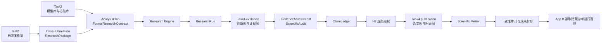

# HypoWeaver 总体架构与 Task4 科研绘图接入规范

> 文档状态：Task4 设计基线；2026-07-22 已按同仓、进程内模块完成第一版接入
>
> 适用范围：Task1 论文案例集、Task2 模型/方法库、Task3 假设验证与复现工作流、Task4 自动化科研绘图
>
> 当前事实源：`backend/src/hypoweaver/definition.py` 与 `backend/src/hypoweaver/models.py`

> 实现更新：原文中的“独立仓库 / 独立 HTTP 服务”是早期交接方案，不再是当前部署要求。`carolzhu-jr/GreenFinance_Plot_Agent` 的渲染能力现已合入 `backend/src/hypoweaver/plot_agent/`，由 `visualization.py` 在同一工作流进程内调用；不需要额外端口。保留严格 Figure 契约和职责边界，是为了隔离“绘图”和“写作”，不是为了分仓。

## 1. 文档目的

这份文档用于统一四项任务之间的架构和数据边界，并给负责 Task4 的同学一份可以独立开发、独立测试、最终通过稳定接口接入 Task3 的实现规范。

Task4 不是一个只在论文完成后“美化图片”的前端组件。它是一个独立的科研图形服务，承担两类工作：

1. 在模型执行后生成诊断图和证据图，供 Evidence Assessment、Scientific Audit 和 H3 人工审核使用；
2. 在 H3 授权结论后生成论文主图和附录图，供 Scientific Writer 引用并随成果包封存。

Task4 不负责提出研究假设、选择计量方法、重新估计模型或判断科学结论。

## 2. 四项任务的职责

### 2.1 Task1：标准论文案例集

Task1 从高质量论文中提取结构化研究案例，至少包括：

- 研究问题与理论背景；
- 原论文提出的假设；
- 分析单位、样本范围和时间范围；
- 变量定义、变量角色和数据字典；
- 原论文采用的数据及可复现的数据文件；
- 原论文采用的方法、模型、稳健性检验和识别策略；
- 原论文最终结果、表格、图形和代码。

这里更准确的称呼是“标准案例集”或“Benchmark 数据集”。只有在明确进行模型微调时，才称为训练集。

每个案例必须分为可见输入和隐藏参考：

```text
case_xxx/
  01_model_input/
    case_profile.json
    hypotheses.json
    data_dictionary.csv
    main_data.csv

  02_hidden_reference/
    published_results.json
    original_tables/
    original_figures/
    original_code/
    evaluation_rubric.json
```

运行 Task3、Task4 和外部基线时，只允许访问 `01_model_input`。`02_hidden_reference` 只允许独立的 App B 盲测服务在主流程封存后读取。

### 2.2 Task2：模型库和方法库

Task2 提供可被 Task3 路由和执行的研究方法能力，包括：

- 方法家族及适用条件；
- 估计器实现；
- 必需字段和数据结构约束；
- 诊断、稳健性、证伪、机制和异质性检验；
- 每种方法的标准输出 Schema；
- 每种方法对应的推荐图形配方。

Task2 负责“怎样估计”，Task4 负责“怎样把已经产生的结果可追溯地画出来”。Task4 不得复制或重新实现 Task2 的统计估计逻辑。

### 2.3 Task3：假设验证与复现工作流

Task3 是总调度器，当前正式链路为：

```text
标准案例包
→ 规范化与确定性校验
→ H1 研究边界确认
→ 假设拆解 + 数据画像
→ 方法路由
→ 方法设计
→ 四类 Critic 与有限修复
→ H2 冻结 FormalResearchContract
→ Fixture / Python Research Engine
→ ResearchRun
→ EvidenceAssessment + ScientificAudit
→ ClaimLedger
→ H3 逐条结论授权
→ 受约束写作与一致性审计
→ 封存成果包
```

Task3 保证：

- H1/H2/H3 是真正会暂停、退回和等待的服务端状态机；
- H2 后的执行必须绑定冻结合同和数据哈希；
- `execution_status=succeeded` 不等于 `scientific_status=valid`；
- Fixture 不得产生系数、p 值、显著性或诊断结果；
- Writer 只能使用 H3 已授权的 Claim；
- 主流程在封存前不得读取隐藏参考结果。

### 2.4 Task4：自动化科研绘图服务

Task4 接收结构化研究结果和授权信息，返回可审计、可复现的图形成果包。

它必须同时满足：

- 论文级视觉质量；
- 确定性和可复现性；
- 与 Execution、Claim 的双向追溯；
- 不补造缺失统计量；
- 不访问隐藏参考；
- 可供 HypoWeaver、Agent Laboratory 和未来其他基线共同调用。

## 3. 当前架构与 Task4 的目标位置



Task4 使用同一个服务完成两次调用，但两次调用的权限和输入不同。

### 3.1 Evidence 阶段调用

位置：`ResearchRun` 生成后，`EvidenceAssessment` 之前。

允许输入：

- `FormalResearchContract` 的标识、哈希及绘图所需设计字段；
- `ResearchRun`；
- `ExecutionRecord`；
- 经登记的数据或结果 Artifact 引用；
- 未经 H3 授权的结果只能用于审计，不得被描述成最终结论。

主要输出：

- 系数与置信区间图；
- 样本筛选流程图；
- 缺失值和变量分布图；
- 残差、异常值和影响点诊断图；
- 平行趋势与事件研究图；
- 稳健性、机制、异质性和空间结果图。

输出 Artifact：`evidence_figure_bundle`。

### 3.2 Publication 阶段调用

位置：H3 授权后，`Scientific Writer` 之前。

允许输入：

- `evidence_figure_bundle`；
- H3 已批准或降级的 `approved_claim_ledger`；
- 获批 Claim 引用的 Execution；
- 期刊样式和语言要求。

主要输出：

- 论文主图；
- 附录图；
- 中英文标题和图注；
- 无障碍描述；
- Figure、Claim、Execution 的追溯信息。

输出 Artifact：`publication_figure_bundle`。

Publication 阶段不得展示被 H3 拒绝、暂缓或未处理的 Claim，也不得通过标题、图注或视觉强调提高 Claim 的授权强度。

## 4. Task4 的系统边界

### 4.1 Task4 负责

- 管理版本化图形配方；
- 根据结构化上下文选择合适配方；
- 验证字段绑定；
- 从已登记 Artifact 读取绘图数据；
- 确定性渲染 SVG、PNG 和 PDF；
- 导出每张图对应的源数据 CSV；
- 生成标题、图注和 alt text；
- 记录输入、配方、软件和输出哈希；
- 返回结构化 `FigureBundle`。

### 4.2 Task4 不负责

- 提出或修改研究假设；
- 决定应该采用哪一种计量方法；
- 重新运行回归或计算新的科学结果；
- 访问原论文、原论文结果或 `02_hidden_reference`；
- 把 p 值或显著性自动解释为因果关系；
- 绕过 H1/H2/H3；
- 在 Task3 Web 进程内执行大模型生成的任意代码；
- 自行决定 Claim 是否成立。

## 5. 推荐内部设计

Task4 建议由四层组成。

### 5.1 Recipe Registry

每个图形配方必须有稳定 ID 和版本，例如：

```text
coefficient_forest@1.0.0
sample_flow@1.0.0
event_study@1.0.0
robustness_matrix@1.0.0
heterogeneity_forest@1.0.0
```

配方声明：

- 适用的研究方法和执行类型；
- 必需字段；
- 可选字段；
- 字段类型和单位；
- 允许的视觉编码；
- 默认排序和坐标轴规则；
- 允许的输出格式；
- 图形质量和审计规则。

### 5.2 AI Figure Planner

大模型可以：

- 从配方库中选择适合的配方；
- 绑定结构化字段；
- 生成标题、图注和 alt text 草稿；
- 在多个候选图中给出优先级。

大模型不可以：

- 输出并执行任意 Python/R/JavaScript 绘图代码；
- 修改源统计量；
- 在输入缺失时推断或补造系数、标准误、置信区间；
- 生成配方库之外的新执行逻辑。

Planner 的输出必须先通过严格 `FigureSpec` Schema，再进入 Renderer。

### 5.3 Deterministic Renderer

Renderer 使用固定实现渲染图形。可以选择 Python 或 R，但第一版只保留一种主渲染栈，避免跨语言产生不一致结果。

确定性要求：

- 固定随机种子；
- 固定并随服务打包的字体；
- 固定颜色、线宽、画布尺寸和 DPI；
- 对输入行和分类值执行稳定排序；
- 不在文件元数据中写入当前时间；
- 同一输入哈希、配方版本和 Renderer 版本产生相同结果；
- 输出中记录实际依赖版本。

### 5.4 Figure Validator

Validator 至少检查：

- 必需字段是否存在；
- 数值是否有限；
- 置信区间上下界是否合理；
- 图注中的统计量是否能在输入中找到；
- Claim 和 Execution 是否真实存在；
- Publication 图是否只引用 H3 授权 Claim；
- Fixture 是否错误生成实证图；
- 坐标轴单位、标签、图例是否齐全；
- 输出文件与源数据是否具有 SHA256；
- 是否存在可能误导的截断坐标轴或视觉编码。

## 6. 对外服务接口

第一版保持最小接口：

```text
GET  /v1/health
GET  /v1/recipes
POST /v1/render
```

先实现同步渲染。只有在真实运行证明单次渲染时间过长后，再增加异步 Job API，不提前增加队列复杂度。

### 6.1 `GET /v1/health`

示例响应：

```json
{
  "status": "ok",
  "service": "hypoweaver-visualization-engine",
  "version": "0.1.0",
  "schema_versions": ["1.0"],
  "renderer": "matplotlib",
  "recipe_count": 5
}
```

### 6.2 `GET /v1/recipes`

至少返回：

- `recipe_id`；
- `version`；
- `title`；
- `supported_stages`；
- `supported_run_types`；
- `required_fields`；
- `optional_fields`；
- `output_formats`。

### 6.3 `POST /v1/render`

请求示例：

```json
{
  "schema_version": "1.0",
  "request_id": "figure-request-001",
  "stage": "evidence",
  "case_id": "case-001",
  "research_run_id": "research-001",
  "contract_hash": "sha256:contract-hash",
  "recipe_id": "coefficient_forest",
  "recipe_version": "1.0.0",
  "source": {
    "artifact_id": "run-001:research_run",
    "artifact_key": "research_run",
    "sha256": "sha256:research-run-hash"
  },
  "execution_ids": ["execution-001"],
  "claim_ids": [],
  "bindings": {
    "term": "term",
    "estimate": "coefficient",
    "ci_lower": "confidence_interval_95[0]",
    "ci_upper": "confidence_interval_95[1]"
  },
  "style_profile": "journal_bw_v1",
  "locale": "zh-CN",
  "formats": ["svg", "png", "pdf", "csv"]
}
```

响应示例：

```json
{
  "schema_version": "1.0",
  "bundle_id": "figure-bundle-001",
  "stage": "evidence",
  "status": "succeeded",
  "figures": [
    {
      "figure_id": "figure-001",
      "recipe_id": "coefficient_forest",
      "recipe_version": "1.0.0",
      "title": "基准模型核心系数及 95% 置信区间",
      "caption": "点表示系数估计，线段表示 95% 置信区间。",
      "alt_text": "核心解释变量的系数点估计和置信区间。",
      "execution_ids": ["execution-001"],
      "claim_ids": [],
      "files": [
        {
          "format": "svg",
          "mime_type": "image/svg+xml",
          "artifact_uri": "artifact://figure-001/main.svg",
          "sha256": "sha256:svg-hash"
        }
      ],
      "data_snapshot": {
        "format": "csv",
        "artifact_uri": "artifact://figure-001/source.csv",
        "sha256": "sha256:source-hash"
      },
      "warnings": []
    }
  ],
  "renderer": {
    "name": "hypoweaver-visualization-engine",
    "version": "0.1.0"
  },
  "warnings": []
}
```

### 6.4 错误响应

错误必须结构化，至少包含：

```json
{
  "error": {
    "code": "MISSING_REQUIRED_FIELD",
    "message": "coefficient_forest requires ci_lower and ci_upper",
    "field": "bindings.ci_lower",
    "retryable": false
  }
}
```

建议错误码：

- `SCHEMA_VALIDATION_FAILED`；
- `RECIPE_NOT_FOUND`；
- `RECIPE_VERSION_MISMATCH`；
- `MISSING_REQUIRED_FIELD`；
- `SOURCE_HASH_MISMATCH`；
- `EXECUTION_NOT_FOUND`；
- `CLAIM_NOT_AUTHORIZED`；
- `FIXTURE_EMPIRICAL_FIGURE_FORBIDDEN`；
- `HIDDEN_REFERENCE_FORBIDDEN`；
- `RENDER_FAILED`。

## 7. 核心 Schema

Task4 至少需要以下领域对象：

### 7.1 FigureRequest

```text
schema_version
request_id
stage: evidence | publication
case_id
research_run_id
contract_hash
recipe_id
recipe_version
source
execution_ids[]
claim_ids[]
bindings{}
style_profile
locale
formats[]
```

### 7.2 FigureSpec

```text
figure_id
recipe_id
recipe_version
field_bindings{}
filters[]
sort_rules[]
labels{}
annotations[]
style_profile
execution_ids[]
claim_ids[]
```

### 7.3 FigureArtifact

```text
figure_id
title
caption
alt_text
recipe_id
recipe_version
execution_ids[]
claim_ids[]
files[]
data_snapshot
warnings[]
```

### 7.4 FigureBundle

```text
schema_version
bundle_id
stage
status
figures[]
renderer
warnings[]
```

所有对象应使用严格 Schema，拒绝未知字段。Schema 文件必须由 Task4 仓库版本控制，并输出 JSON Schema 或 OpenAPI 定义供 Task3 生成客户端或执行契约测试。

## 8. 第一版图形配方

第一版不要追求覆盖所有科研图。按当前 Task3 执行能力，分成必须打通和接口预留两组。

### 8.1 必须真实打通

#### `coefficient_forest`

用途：展示一个或多个 Execution 中的系数和置信区间。

必需字段：

- term；
- coefficient；
- confidence interval lower；
- confidence interval upper；
- execution_id。

规则：

- 必须显示零参考线；
- 不根据 p 值改变 Claim 强度；
- 排序必须稳定；
- 图注说明置信区间口径；
- 缺少置信区间时失败，不自行使用标准误推算，除非配方契约明确允许并记录计算来源。

#### `sample_flow`

用途：展示原始行数、缺失剔除、重复主键剔除和最终估计样本。

必需字段：

- rows_input；
- rows_used；
- rows_dropped。

规则：

- 数量必须闭合；
- 无法区分剔除原因时不得虚构分项；
- 图形同时输出机器可读 CSV。

### 8.2 提供固定 Fixture 与接口

#### `event_study`

展示事件时间系数、置信区间和处理前参考区间；不自动宣称平行趋势成立。

#### `robustness_matrix`

展示多个冻结规格中的估计方向、置信区间和执行状态；失败规格必须保留而不是隐藏。

#### `heterogeneity_forest`

展示分组估计及置信区间；图注必须说明分组定义，不把“组内显著、组间不显著”自动解释为组间差异显著。

后续再根据 Task2 的方法库增加空间图、机制路径图、结构模型图、测度效率图等配方。

## 9. 数据与 Artifact 访问

Task3 不应在 HTTP 请求中发送完整原始数据。推荐方式：

1. Task3 发送 Dataset/Artifact ID、SHA256 和字段选择器；
2. Task4 使用只读身份从受控 Artifact Store 读取所需文件；
3. Task4 重新计算 SHA256 并与请求值核对；
4. Task4 只读取配方声明需要的字段；
5. Task4 把图形源数据快照与图一起写入 Artifact Store；
6. Task3 保存返回的 FigureBundle envelope 和哈希。

本地第一版可以使用受控共享目录，但接口中不得返回开发者机器的绝对路径。统一返回 `artifact_uri` 或相对对象存储 key。

Task4 的运行身份必须在文件系统或对象存储 ACL 层面无法访问 `02_hidden_reference`，不能只依靠 Prompt 或文件名关键词过滤。

## 10. Task3 与 Task4 的代码所有权

### 10.1 Task4 同学负责

- 同仓目录 `backend/src/hypoweaver/plot_agent/`；
- OpenAPI/JSON Schema；
- Recipe Registry；
- AI Figure Planner；
- Renderer；
- Validator；
- 示例请求和固定 Fixture；
- 单元测试、契约测试和确定性测试；
- 本地启动说明；
- Task4 自己的版本和变更记录。

### 10.2 Task3 团队负责

- 在 `models.py` 增加或映射 Figure Schema；
- 在 `visualization.py` 维护严格 Figure 契约和进程内 adapter；
- 在工作流中增加两次调用节点；
- 把 FigureBundle 写入 SQLite Artifact；
- 将 FigureBundle 哈希加入封存清单；
- 在前端展示图形、图注、警告和追溯信息；
- 在一致性审计中校验 Publication Figure 的 Claim/Execution 引用。

Task4 同学只需维护 `plot_agent/` 内的配方与渲染质量，不需要直接修改 Task3 状态机；Task3 团队维护调用时机、Claim 边界、封存和前端展示。

## 11. Task3 目标改动

目标工作流变为：

```text
research_run_merge
→ evidence_visualization
→ evidence_assessment
→ scientific_audit
→ claim_ledger
→ H3
→ publication_visualization
→ scientific_writer
→ consistency_audit
→ complete
```

建议新增 Artifact：

```text
evidence_figure_bundle
publication_figure_bundle
```

建议扩展：

- `ManuscriptPackage` 增加 `figure_ids`；
- 可追溯章节增加所引用的 `figure_ids`；
- `sealed_output` 增加两个 FigureBundle 的 SHA256；
- consistency audit 检查 Figure 引用的 Claim 和 Execution；
- Fixture 或 plan-only 运行跳过实证图，记录明确的 `not_generated` 原因。

这些属于目标设计，当前代码尚未实现，不能在界面或汇报中表述为已完成。

## 12. 安全与科学完整性要求

- Task4 不得访问 `02_hidden_reference`；
- Task4 不得根据原论文图形复刻当前测试案例的答案；
- Task4 不得修改冻结合同或 ResearchRun；
- Task4 不得把执行成功显示成科学有效；
- Task4 不得隐藏失败模型、空结果或不显著结果；
- Task4 不得自动截断坐标轴制造夸张差异；
- Task4 不得用视觉强调绕过 Claim 的 allowed strength；
- Publication 图只能引用 H3 已批准或降级的 Claim；
- 图注中的数字必须来自源数据快照；
- 所有输入输出均保存 SHA256 和版本信息；
- 密钥、Token、本机绝对路径和未脱敏原始数据不得进入 Git。

## 13. 视觉质量规范

默认提供 `journal_bw_v1` 样式：

- 黑白打印可辨识；
- 色盲友好；
- 中文和英文字体稳定；
- 统一字号、线宽、边距和图例；
- 禁止 3D、阴影、装饰性渐变和无意义图标；
- 默认输出矢量 SVG/PDF；
- PNG 用于前端预览，使用固定 DPI；
- 图形标题简短，统计口径放在图注；
- 图注说明样本、估计口径、置信区间和必要限制；
- alt text 描述图形内容，不替代科学结论。

后续可以增加期刊样式，但不能让样式改变数据映射和科学含义。

## 14. 测试与验收

### 14.1 单元测试

- 每个 Recipe 的字段验证；
- 稳定排序；
- 标签和单位；
- Claim/Execution 引用校验；
- Fixture 边界；
- 隐藏路径拒绝；
- 错误码和错误字段。

### 14.2 契约测试

Task3 与 Task4 共用固定请求/响应 Fixture：

```text
contracts/
  v1/
    evidence_coefficient_request.json
    evidence_coefficient_response.json
    publication_request.json
    publication_response.json
    errors/
```

Task4 修改 Schema 时必须运行这些 Fixture；破坏兼容性的修改必须升级 `schema_version`。

### 14.3 确定性测试

同一请求连续运行两次，检查：

- FigureBundle 的语义内容一致；
- 源数据 CSV 哈希一致；
- SVG/PDF/PNG 哈希一致；
- 不包含当前时间、随机 UUID 或不稳定排序；
- Renderer 和 Recipe 版本一致。

如果所选文件格式存在不可避免的非确定性元数据，必须在写出时清除，不能降低验收标准。

### 14.4 最终验收清单

- [ ] `/v1/health` 返回服务、Schema 和 Renderer 版本；
- [ ] `/v1/recipes` 返回可验证的配方元数据；
- [ ] `coefficient_forest` 使用真实 Task3 ResearchRun 成功渲染；
- [ ] `sample_flow` 使用真实 Task3 diagnostics 成功渲染；
- [ ] 每张图同时输出 SVG、PNG、PDF 和源数据 CSV；
- [ ] 每个文件都有 SHA256；
- [ ] 不存在的 Execution ID 被拒绝；
- [ ] 未授权 Claim 在 Publication 阶段被拒绝；
- [ ] Fixture 实证图被拒绝；
- [ ] 隐藏参考路径被拒绝；
- [ ] 缺少必需字段时明确失败且不补造数据；
- [ ] 同一输入重复渲染结果确定；
- [ ] Task3 仅通过 HTTP 和 Schema 接入，不导入 Task4 内部实现；
- [ ] 至少提供一份端到端示例和本地启动说明。

## 15. 推荐交付节奏

### Milestone 1：冻结契约

交付：

- OpenAPI；
- FigureRequest/FigureSpec/FigureArtifact/FigureBundle Schema；
- 两个成功 Fixture；
- 主要错误响应 Fixture。

验收：Task3 能在不运行 Task4 的情况下，用 Fixture 完成 adapter 契约测试。

### Milestone 2：最小真实渲染

交付：

- `coefficient_forest`；
- `sample_flow`；
- SVG/PNG/PDF/CSV；
- 哈希与确定性测试。

验收：能够直接消费当前 Task3 的面板基准执行结果。

### Milestone 3：AI Planner 与 Publication 边界

交付：

- 配方选择与字段绑定；
- H3 Claim 授权校验；
- 标题、图注和 alt text；
- Publication FigureBundle。

验收：被拒绝 Claim 无法出现在论文图中。

### Milestone 4：扩展配方

交付：

- event study；
- robustness matrix；
- heterogeneity forest；
- 与 Task2 新方法输出的契约测试。

验收：每个新配方都由对应方法的真实或固定结构化输出驱动，不通过临时代码适配。

## 16. 给 Task4 同学的简版任务说明

> 请实现一个独立的科研图形服务。服务不负责提出假设、选择计量方法、重新估计模型或判断结论，只负责把结构化 ResearchRun 和已授权 ClaimLedger 转换成可审计、可复现的科研图。大模型只能选择已注册图形配方、绑定字段并生成文案，不得生成和执行任意绘图代码。
>
> 服务第一版提供 `/v1/health`、`/v1/recipes`、`/v1/render`，输出 SVG、PNG、PDF、源数据 CSV 和 FigureBundle JSON。每张图记录 recipe/version、输入哈希、execution_ids、claim_ids、标题、图注、alt text、警告和输出哈希。
>
> 服务不得读取原论文、发表结果或 `02_hidden_reference`。同一输入、同一配方、同一 Renderer 和同一字体环境必须产生确定性结果。缺少必需字段时明确失败，不得补造数值。
>
> 第一版必须真实实现 `coefficient_forest` 和 `sample_flow`，并为 `event_study`、`robustness_matrix`、`heterogeneity_forest` 提供固定 Fixture 和接口。Task3 团队负责状态机和 HTTP 接入，你不需要直接修改 Task3 引擎。

## 17. 完成定义

Task4 的完成不是“能画出一张好看的图”，而是：

1. 能从当前 Task3 的真实结构化结果稳定生成图；
2. 图形及其数据、版本、Claim 和 Execution 全部可追溯；
3. 诊断图能在科学审计前使用；
4. 论文图受到 H3 授权边界约束；
5. 同一接口可供 HypoWeaver 和其他 Benchmark 系统调用；
6. 输出能够随主 Run 一起封存，并由 App B 独立评估。
